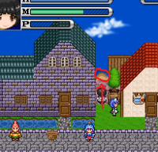

# 西大陆篇（挖坑中）

## レイオンの村（莱昂村）
初始地图
（除非你开局选了逃亡奴隶）

#### ┗ ローラント地下監獄(罗兰德地下监狱)

>  前期不用去送死

利莫里亚奴隶市场酒吧冒险家打听莱昂村情报->莱昂村线人

#### ┗  裏通り（后街）
>  开局就去可以速通 （热兵器结局）哦

位置：

#### ┗┗ 異世界への門(异世界之门)
开启**主线**的地方，通过后街前往，需要有チェーンフレイル（连枷）这种武器，不断蓄力移动到对岸的铁柱才能抵达。

## 近くの森（附近的森林）

